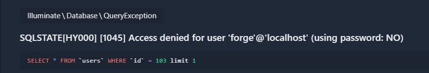

<h1>A.J.E.G</h1>

<H3>
Association des joueurs d'échec de glanum</H3>

 
<i>Spect technique : PHP 8.0.14 
Laravel : 9.19, projet orienté livewire</i>

<h3>Sommaire : </h3>
<ul><li>1) Profil utilisateur </li>
<li>2) Game </li>
<li>3) Tournois </li>
<li>4) Monnaie virtuelle </li>
<li>5) Notion de paris </li></ul>

<h3>PROFIL UTILISATEUR</h3>

Chaque utilisateur doit s'identifier avec son email impérativement, vérification d'email. 

Un utilisateur peut être ou non licencié à l'association par une cotisation de 5€ par trimestre
(plus tard cela donnera des avantages sur l'application)

Un joueur a un ratio par rapport à ses parties jouées et un classement par rapport a tous les joueurs.

<h3>GAME</h3>

Chaque utilisateur peut créer une partie, avec différents statuts : 
<ul>
<li>Pas encore commencé : envoie une notif ( mail ) aux autre joueurs</li>
<li>En cours, pour sauvegarder une partie via une photo </li>
<li>Terminé, l'utilisateur peut insérer les résultats de la partie et sera en attente de l'autre confirmation de l'autre joueur</li>
</ul>

<h3>TOURNOIS</h3>

<h3>MONNAIE VIRTUELLE</h3>

Chaque jours, tous les joueurs pourront recolter des monnaies virtuelles, plus ils 
cumule les jours plus il gagne de pieces. 

Pour chaque partie jouée, les joueurs misent obligatoirement un montant (montant_min) qui peut bouger en fonction des saisons

Si le joueur choisi une partie pariée : 
  Il peut choisir de parier le nombre de pieces qu'il souhaite. Il gagnera alors s'il gagne les pieces qu'il a misé + la même somme que sont adversaire à misé. 

<h3>NOTION DE PARIS</h3>

Une personne lamba poura miser sur une partie en attente d'etre jouée, le systeme de pari dépend de la côte du joueur : 
Plus son ranking est elevé plus la cote est faible et inversement

<h3>Notion de ranked </h3>
Point de ranked -> On commence avec 100 points 
<ul><li>WIN => +3 points </li>
<li>PATH => +1 points </li>
<li>NUL => +0 points </li>
<li>LOOSE =>  -3 points </li>
</ul>

⚠ ces variables peuvent être modifiées à chaque fin de saison. 

Chaque partie est ranked mais n'a pas les mêmes coeficients :

<ul>
<li>Normal game : coef x 1 en point </li>
<li>Money game :  coef x 2 en point </li>
<li>Ranked game : coef x 3 en point </li>
</ul>

<h3>Notion de saison </h3>
Chaque mois , une nouvelle saison débute et le master de la saison qui vient de se dérouler remporte un badge de grand maitre. +1000 crédits 

⚠ si cette erreur SQL intervient: 

entrez cette commande : php artisan config:cache 
après chaques modification du .env
